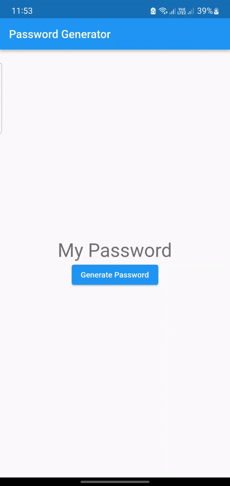
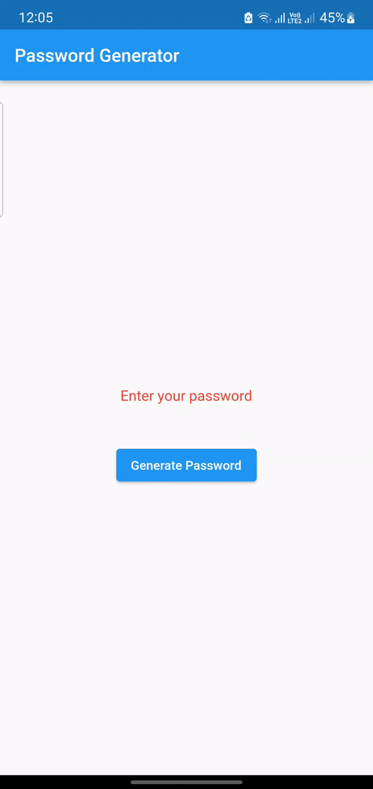

# Password Generator Package

##Introduction:
- This a simple package to handle a lot of passwords operations like generating or validating


## Getting Started

- Add your package to your dependencies:

```yaml
dependencies:
  ...
  password_generate: ^0.0.1
```

## Features

- Generate password with specific length
- Check password strength and return message
- Check password strength and return boolean

| Password generate | Password check |
| :---------------: | :------------: |
|  |  |


## Usage

```dart
final passwords = PasswordGenerator();

//============ To generate password ================
String newPassword = passwords.passwordGenerate(8); //8 is password length

/*============ To check password strength and return message ================
New password is the first input ======== 8 is the minLength for password checker */
String message=passwords.isPasswordValidWithMessage(newPassword,8); 

/*============ To check password strength and return boolean ================
New password is the first input ======== 8 is the minLength for password checker
*/
bool check=passwords.isPasswordValid(newPassword,8);

```


